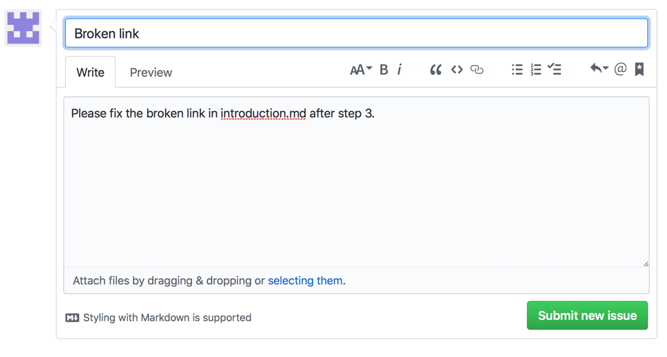

# Überblick über den Mitarbeiter-Leitfaden für die Adobe-Dokumentation

## Was ist die Dokumentation zur Zusammenarbeit?

Im Laufe des Jahres 2019 wird die gesamte technische Dokumentation und der Aktivierungsinhalt für Adobe Experience Cloud auf eine neue Plattform basierend auf Open-Source-Prinzipien umgestellt, die GitHub-, Markdown- und Adobe Experience Cloud-Lösungen nutzen, einschließlich Adobe Experience Manager, Analytics, Launch und Target.

Dieses Open-Source-Modell verbessert die Qualität der Inhalte und die Kommunikation zwischen Kunden, Dokumentationsteams und Produktteams. Auf jeder Seite können Sie jetzt Nutzbarkeit von Inhalten, Protokollprobleme und sogar Inhaltsvorschläge als Git-Pull-Anfragen (PRs) bewerten. Die Adobe-Dokumentationsteams überwachen die Beiträge und Probleme täglich und nehmen nach Bedarf Aktualisierungen und Anpassungen vor.

## Arbeiten mit Dokumentation zur Zusammenarbeit

Als Anwender dieses Materials haben Sie - unabhängig davon, ob Sie Angestellter, Partner, Kunde oder potenzieller Kunde sind - die Wahl, auf verschiedene einfache Weise zu dieser Dokumentation beizutragen.

* Die Nützlichkeit der Seite bewerten
* Ein Problem auf einer bestimmten Seite protokollieren
* Sie können sogar kurze Bearbeitungen durchführen, um komplette Artikel zu verfassen, einschließlich Assets und Codebeispielen

In diesem Handbuch wird alles beschrieben, was Sie für einen Beitrag zu diesem Materialsatz wissen müssen.

<!--
> [!IMPORTANT]
> All repositories that publish to docs.adobe.com have adopted the [Adobe Open Source Code of Conduct](../code-of-conduct.md) or the [.NET Foundation Code of Conduct](https://dotnetfoundation.org/code-of-conduct). For more information, see the [Contributing](../contributing.md) article.
>
> Minor corrections or clarifications to documentation and code examples in public repositories are covered by the [Adobe Documentation Terms of Use](https://www.adobe.com/legal/terms.html). New or significant changes generate a comment in the pull request, asking you to submit an online Contribution License Agreement (CLA) if you are not an employee of Adobe. We need you to complete the online form before we can review or accept your pull request.
-->

## Vorhandene Dokumente schnell bearbeiten

Das schnelle Bearbeiten ist eine gute Möglichkeit, kleine Fehler in Dokumenten zu beheben oder fehlenden Inhalt hinzuzufügen. Wenn ein Artikel wie unten gezeigt eine Schaltfläche zum Bearbeiten anzeigt, können Sie selbst eine schnelle Korrektur vornehmen. Wenn Sie das Dokument bearbeiten, übermitteln Sie eine Pull-Anfrage (PA) an uns, um die Korrektur/den Vorschlag an uns zu senden, und wir können den Vorschlag prüfen, genehmigen und veröffentlichen.

1. Unterschreiben Sie die [Lizenzvereinbarung für Mitarbeiter (CLA)](http://opensource.adobe.com/cla.html), falls akzeptabel.

   Sie müssen nur einmal eine Adobe-Lizenzvereinbarung für Mitarbeiter übermitteln.
1. Klicken Sie in der rechten Spalte auf **`Edit this page`**, um zur Markdown-Quelldatei auf GitHub zu wechseln.
1. Klicken Sie auf das Stiftsymbol, um den Artikel zu bearbeiten.

   > [!NOTE]
   > Wenn das Stiftsymbol ausgegraut ist, müssen Sie sich bei Ihrem GitHub-Konto anmelden oder ein neues Konto erstellen.

   

1. Nehmen Sie Ihre Änderungen im Webeditor vor. Sie können auf die Registerkarte **Preview changes** klicken, um die Formatierung Ihrer Änderung zu überprüfen.
1. Nachdem Sie die Änderung(en) vorgenommen haben, führen Sie einen Bildlauf zum unteren Rand der Seite durch. Geben Sie einen Titel und eine Beschreibung für Ihre PA ein und klicken Sie auf **Propose file change**, wie in der folgenden Abbildung dargestellt:

   

   >[!NOTE] Wenn Sie eine Validierungsfehlermeldung zum Unterschreiben einer Lizenzvereinbarung für Mitarbeiter (CLA) erhalten, klicken Sie auf **Details**, um die Lizenzvereinbarung zu öffnen. Unterschreiben Sie die Vereinbarung, falls akzeptabel. Schließen und öffnen Sie dann die Pull-Anfrage und fahren Sie fort.

Das ist alles. Vielen Dank! Mitglieder des Dokumentationsteams überprüfen Ihre Pull-Anfrage und führen sie zusammen.

## Problem protokollieren

Eine weitere einfache Möglichkeit, uns über ein Problem mit einem Inhaltselement zu informieren, ist die Funktion „Problem protokollieren“.

1. Wenn ein Problem mit einem Inhaltselement auftritt, klicken Sie auf den `Log an Issue`-Link in der rechten unteren Ecke einer beliebigen Seite. Siehe Abbildung unten:

   

   > [!NOTE]
   > Sie müssen sich bei Ihrem GitHub-Konto anmelden bzw. ein neues Konto erstellen, um ein Problem zu protokollieren.

   Durch Klicken auf diesen Link können Sie mit der GitHub-Problemoberfläche ein kurzes Ticket bei uns protokollieren.

1. Die URL der Seite mit dem Problem wird automatisch im Beschreibungsfeld eingetragen. Füllen Sie den Titel aus, schreiben Sie eine kurze Erläuterung des Problems und klicken Sie dann auf *Submit new issue*.

   

Durch das Melden eines Problems wird das Inhaltsteam direkt auf diese Seite hingewiesen und kann entsprechend handeln. Wenn wir den Inhalt aktualisiert haben, teilen wir Ihnen dies in der GitHub-Problemoberfläche mit und Sie werden bei Aktualisierung oder Schließung des Problems per E-Mail informiert.

## GitHub-Berechtigungen verstehen

Die GitHub-Bearbeitungsbenutzeroberfläche passt sich Ihren Repository-Berechtigungen an. Die vorherigen Bilder beziehen sich auf Mitarbeiter, die keine Schreibrechte für das Ziel-Repository besitzen. GitHub erstellt in Ihrem Konto automatisch eine Abspaltung des Ziel-Repositorys. Wenn Sie über Schreibzugriff für das Ziel-Repository verfügen, erstellt GitHub im Ziel-Repository eine neue Verzweigung.

Adobe verwendet Pull-Anfragen für alle Änderungen, selbst für Mitarbeiter, die über Schreibzugriff verfügen. Für die meisten Repositorys ist die `master`-Verzweigung geschützt, sodass Aktualisierungen als Pull-Anfragen übermittelt werden müssen.

Die Bearbeitung im Browser eignet sich am besten für geringfügige oder selten durchgeführte Änderungen. Wenn Sie große Beiträge einbringen oder erweiterte Git-Funktionen verwenden, empfehlen wir Ihnen, das [Repository abzuspalten und lokal zu arbeiten](setup/full-workflow.md).

## Feedback geben

Bei einer Lösung, die so groß wie die von Adobe ist, wird die Dokumentation ständig bearbeitet. Wenn Sie Fehler finden, protokollieren Sie ein Problem, und wenn Sie Vorschläge zu Material haben, teilen Sie uns dies mit. Teilen Sie uns mit, wonach Sie gesucht haben. Lassen Sie uns wissen, wenn Sie nicht finden konnten, was Sie benötigen, oder wenn Sie Schwierigkeiten hatten, Ihre Aufgabe abzuschließen. Teilen Sie uns mit, wie wir Ihnen beim Erlernen unserer Lösungen helfen können.

Das Team für die gemeinsame Dokumentation zur Zusammenarbeit und alle Autoren sowie Inhaltsinhaber der [!UICONTROL Adobe Experience Cloud] bedanken sich.
