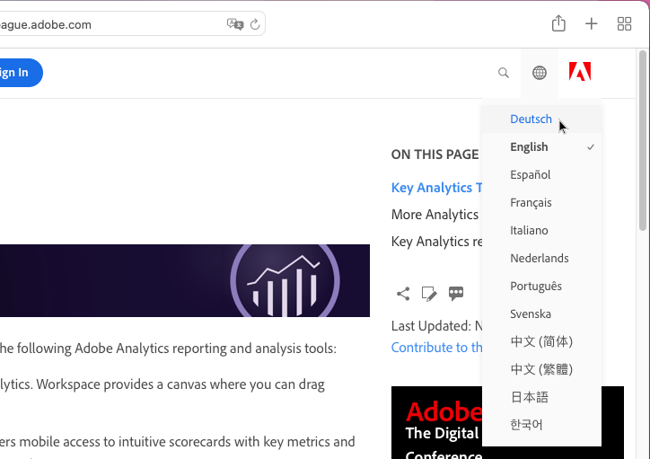
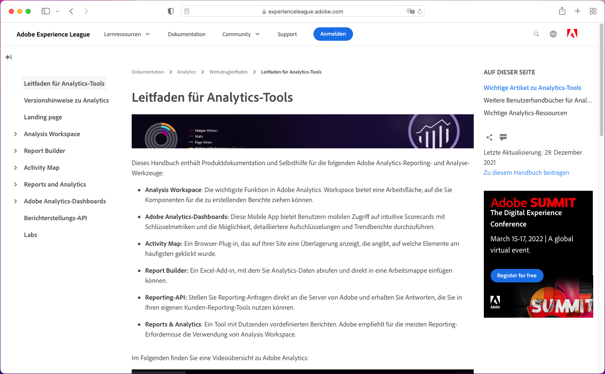
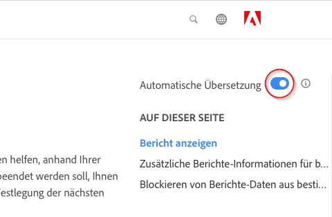
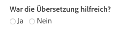

# Sprachunterstützung für die Produktdokumentation von Adobe Experience Cloud

Für Adobe ist klar, dass Sie sich darauf verlassen, die Produktdokumentation, Hilfe und Support-Inhalte in den von Adobe-Produkten unterstützten Sprachen zu erhalten. Um dieses Ziel zu erreichen, bietet Adobe ein einzigartiges Übersetzungserlebnis, mit dem Sie die gewünschte Sprache auswählen und Feedback über die Qualität der übersetzten Inhalte geben können.

## Sprache auswählen

Die Produktdokumentation von Adobe Experience Cloud ist in den meisten Sprachen verfügbar.

1. Navigieren Sie zur Experience Cloud-[Produktdokumentation](https://helpx.adobe.com/de/support/experience-cloud.html).

1. Suchen Sie nach einer Hilfeseite (z. B. [Analytics](https://docs.adobe.com/content/help/de-DE/analytics/landing/home.html)).

1. Klicken Sie auf die Sprachauswahl (Weltsymbol) und wählen Sie dann eine Sprache aus.

   

   Die Seite wird in der von Ihnen gewählten Sprache angezeigt.

   

   Wenn Ihre Sprachversion noch nicht verfügbar ist, kann Adobe die Inhalte automatisch übersetzen. Der automatische Übersetzungsdienst von Adobe zeigt eine Meldung oben im rechten Navigationsbereich an:

   

   Der Inhalt wird möglicherweise automatisch in Ihre Sprache übersetzt angezeigt. Alternativ können Sie auf einen Link klicken, um den Inhalt automatisch übersetzen zu lassen. (Dieser anklickbare Link wird dann angezeigt, wenn Sie über einen Link von der übersetzten Seite zum englischen Ausgangstext zurückgekehrt sind. Danach können Sie die bei Bedarf wieder durch Anklicken eines Links die übersetzte Seite anzeigen.) Sie können jederzeit zum englischen Ausgangstext zurückkehren.

   Gelegentlich kann es sein, dass der englische Ausgangstext kurz zuvor schon aktualisiert und veröffentlicht wurde, bevor die Übersetzungen abgeschlossen wurden. Wenn Sie im Dropdown-Menü auf Ihre Sprache klicken, wird Ihnen in der hellblauen horizontalen Leiste oben auf der Seite eine Benachrichtigung angezeigt, dass die Seite automatisch aus der vorherigen Version übersetzt wurde und demnächst aktualisierte Inhalte verfügbar sein werden. Wenn Sie möchten, können Sie den aktuellen englischen Ausgangstext in einem neuen Browser-Fenster anzeigen.

## Warum die automatische Übersetzung nutzen?

Adobe nutzt die Vorteile der automatischen Übersetzung, um Inhalte für den Produktsupport in verschiedenen Sprachen zu veröffentlichen, und zwar so zeitnah zur Inhaltserstellung wie möglich. Da Support-Inhalte für die Produktnutzung entscheidend sind, lassen wir unsere Inhalte von qualifizierten Fachleuten übersetzen. Bei wichtigen Inhalten, die schnell veröffentlicht werden müssen, entscheiden wir uns aber auch für die automatische Übersetzung.

Die automatische Übersetzung ist im Internet allgegenwärtig und ist allgemein als leistungsfähiges Mittel zur Informationsgewinnung anerkannt. Sie wird bereits weitgehend für Inhalte in Wissensdatenbanken genutzt, wo es bereits wenig bis gar keine menschlichen Eingriffe mehr gibt. Obwohl es in den letzten Jahren zu großen technologische Durchbrüchen gekommen ist, können automatisch generierte Übersetzungen gelegentlich Ungenauigkeiten und Fehler bei der Sprache und Bedeutung enthalten.

### Automatische Übersetzung über den Browser

Wenn Seiten in Ihrem Browser automatisch in Ihre Sprache übersetzt werden, sollten Sie beachten, dass die generierten Übersetzungen von denen auf der Adobe-Seite abweichen. Der Grund dafür ist, dass der vom Browser angebotene Service möglicherweise allgemeine Übersetzungen nutzt, während die Adobe-Übersetzungen so angepasst wurden, dass sie den Stilrichtlinien und der Terminologie von Adobe entsprechen. Um optimale Ergebnisse bei der automatischen Übersetzung zu erzielen, empfehlen wir Ihnen, entweder die Browseroption für diese bestimmte Website in Ihren Browsereinstellungen zu deaktivieren oder auf **Niemals übersetzen** zu klicken, wenn Sie gefragt werden.

### Bekannte Probleme

Gelegentlich kann es bei automatisch generierten Übersetzungen zu Problemen kommen, etwa zu unvollständigen Übersetzungen, falschen Zeichen oder Problemen mit dem Seitenlayout. Diese werden durch die verschiedenen Tools für die Erstellung, Veröffentlichung oder Übersetzung verursacht, die Adobe verwendet. Wir versuchen, die bekannten Probleme nachfolgend so umfassend wie möglich aufzulisten.

| **PROBLEM-ID** | **BESCHREIBUNG** | **STATUS** |
|--------------|-------------------------------------------------------------------------------------|------------|
| G11N3558 | Einige Seiten des Audience Managers sind zur Hälfte noch auf Englisch und zur Hälfte bereits übersetzt (Französisch, Spanisch). | OFFNEN |

### Feedback

Immer wenn Inhalte automatisch übersetzt werden, entweder standardmäßig oder durch den Benutzer, kann Feedback zur Übersetzung an Adobe übermittelt werden. In der hellblauen horizontalen Leiste oben auf der Seite können Sie die Frage &quot;War diese Übersetzung nützlich?&quot;mit &quot;Ja&quot;oder &quot;Nein&quot;beantworten. Adobe sammelt diese wichtigen
Metriken und analysiert die gesammelten Daten, um Entscheidungen über die Übersetzung von Inhalten zu treffen. Wir würden uns über Ihr Feedback freuen.

Bald haben Sie die Möglichkeit, umfangreicheres Feedback mit Problemprotokollierungen, Verbesserungsvorschlägen und sogar Anfragen für zusätzliche Sprachen zu geben. Einige dieser Funktionen sind bereits auf den englischen Seiten verfügbar. Langfristig glauben wir, dass dies die Benutzerfreundlichkeit auf den
Adobe-Seiten verbessern wird.

<!--

-->

### Haftungsausschluss für Übersetzungen

Adobe verwendet ein Programm für maschinelle Übersetzung, um Text in verschiedene Sprachen zu übersetzen. Bitte beachten Sie, dass automatische Übersetzungen wörtliche Übersetzungen sind und Fehler enthalten können. Adobe übernimmt keine Gewähr für die Genauigkeit, Zuverlässigkeit oder Aktualität der bereitgestellten Übersetzungen. Adobe haftet nicht für Verluste oder Schäden, die aufgrund des Vertrauens auf die Genauigkeit oder Zuverlässigkeit der übersetzten Informationen entstehen. Wenn es Unterschiede zwischen der englischen Version und einer anderen Sprache gibt, hat die englische Version Vorrang.

Wenn Sie einen Übersetzungsfehler oder eine Ungenauigkeit melden möchten, bitten wir Sie, uns zu kontaktieren.
