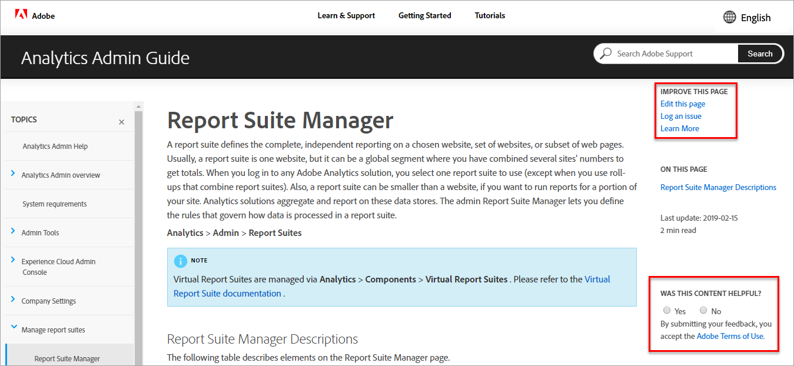

# Sprachunterstützung für Adobe Experience Cloud-Produktdokumentation

Adobe erkennt an, dass Sie auf Produktdokumentation, Hilfe und Supportinhalte angewiesen sind, damit diese problemlos in von Adobe-Produkten unterstützten Sprachen verfügbar sind. Um dieses Ziel zu erreichen, bietet Adobe ein einzigartiges Übersetzungserlebnis, mit dem Sie die Sprache Ihrer Wahl auswählen und Feedback zur Qualität der übersetzten Inhalte geben können.

## Sprache auswählen

Sie können die Produktdokumentation zu Adobe Experience Cloud in den meisten Sprachen anzeigen.

1. Navigieren Sie zur Experience Cloud- [Produktdokumentation](https://helpx.adobe.com/support/experience-cloud.html).

1. Suchen Sie nach einer Hilfeseite (z. B. [Analytics](https://docs.adobe.com/content/help/en/analytics/landing/home.html)).

1. Klicken Sie auf das Sprachauswahl-Symbol (World-Symbol) und wählen Sie dann eine Sprache aus.

   

   Die Seite wird in der von Ihnen gewählten Sprache angezeigt.

   

   Wenn Ihre Sprachversion noch nicht verfügbar ist, kann Adobe Ihre Inhalte automatisch übersetzen. Der automatische Übersetzungsdienst von Adobe zeigt eine Meldung oben auf der Seite in einem blauen Feld an:

   

   Der Inhalt kann automatisch in Ihrer Sprache wiedergegeben werden, oder Sie können auf einen Link klicken, um die Übersetzung auszulösen. (Dieses Szenario kann auftreten, wenn Sie auf den Hyperlink geklickt haben, um von der übersetzten Seite zur englischen Quelle zurückzukehren. Sie haben die Möglichkeit, die übersetzte Seite bei Bedarf anzuzeigen.) Sie können jederzeit zur englischen Quelle zurückkehren.

   Gelegentlich wurde der englische Quellinhalt möglicherweise vor Abschluss der Übersetzungen aktualisiert und veröffentlicht. Wenn Sie im Dropdown-Menü auf Ihre Sprache klicken, wird eine Benachrichtigung angezeigt — in der hellblauen horizontalen Leiste oben auf der Seite — , die darauf hinweist, dass die Seite automatisch aus der vorherigen Version übersetzt wurde, wobei aktualisierte Inhalte bald verfügbar sein werden. Sie erhalten die Möglichkeit, den neuesten englischen Quellinhalt in einem neuen Browserfenster anzuzeigen, falls gewünscht.

## Warum automatische Übersetzung

Adobe nutzt die automatischen Übersetzungsfunktionen, um Inhalte zur Produktunterstützung in verschiedenen Sprachen so schnell wie möglich zu veröffentlichen. Da Supportinhalte für die Nutzung von Produkten von entscheidender Bedeutung sind, legen wir der Übersetzung von Inhalten durch qualifizierte Fachkräfte Priorität ein. Wir können uns aber auch für automatische Übersetzungen entscheiden, bei denen Geschwindigkeit und Dringlichkeit am wichtigsten sind.

Die automatische Übersetzung ist im Internet allgegenwärtig und wird allgemein als leistungsfähiges Werkzeug zur Informationserfassung akzeptiert. Es wurde weithin für Inhalte der Wissensgrundlage angenommen, wo es wenig bis gar keine menschlichen Eingriffe geben könnte. Obwohl es in den letzten Jahren bedeutende technologische Durchbrüche gegeben hat, können automatisch erstellte Übersetzungen gelegentliche Ungenauigkeiten und Fehler in Sprache und Bedeutung enthalten.

### Automatische Übersetzung über den Browser

Wenn Sie Ihre Browsereinstellungen so eingestellt haben, dass eine Seite automatisch in Ihre Sprache übersetzt wird, beachten Sie, dass die resultierenden Übersetzungen sich von den Übersetzungen auf der Adobe-Seite unterscheiden. Der Grund dafür ist, dass der vom Browser angebotene Dienst möglicherweise Übersetzungen aus Beständen sind, während die Adobe-Übersetzungen an die Adobe-Stilrichtlinien und -Terminologie angepasst wurden. Um optimale Ergebnisse bei der automatischen Übersetzung zu erzielen, sollten Sie entweder die Browseroption für diese bestimmte Site in Ihren Browsereinstellungen deaktivieren oder auf **Nie übersetzen** klicken, wenn sie angezeigt wird.

### Bekannte Probleme

Eventuell treten bei Ihnen Probleme mit der automatischen Übersetzungsausgabe auf, z. B. unvollständige Übersetzungen, beschädigte Zeichen oder Probleme mit dem Seitenlayout. Diese werden von den verschiedenen Werkzeugen zur Inhaltserstellung, -veröffentlichung oder -übersetzung verursacht, die Adobe verwendet. Wir werden alles tun, um die bekannten Probleme unten aufzulisten.

| **PROBLEME-ID** | **BESCHREIBUNG** | **STATUS** |
|--------------|-------------------------------------------------------------------------------------|------------|
| G11N3558 | Einige Audience Manager-Seiten sind halb Englisch und halb übersetzt (Französisch, Spanisch). | OPEN |

### Feedback 

Bei jeder automatischen Übersetzung von Inhalten, entweder standardmäßig oder durch Benutzeraktion, gibt es die Möglichkeit, Adobe Feedback zu den Übersetzungen zu geben. In der hellblauen horizontalen Leiste oben auf der Seite können Sie "Ja"oder "Nein"auf die Frage "War diese Übersetzung nützlich?"antworten. Adobe erfasst diese wertvolle Metrik und analysiert die kompilierten Daten, um Entscheidungen über die Inhaltsübersetzung zu treffen. Wir schätzen Ihr Feedback und empfehlen Ihnen, darauf zu reagieren.

Für die Zukunft planen wir, dass Sie ausführlichere Feedback geben können, indem Sie ein Problem protokollieren, Verbesserungsvorschläge machen und sogar zusätzliche Sprachen anfordern. Einige dieser Funktionen sind bereits auf den englischen Seiten verfügbar. Langfristig glauben wir, dass dies Adobe dabei helfen wird, die Benutzererfahrung auf diesen Seiten zu verbessern.

