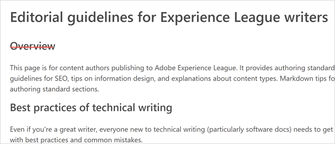
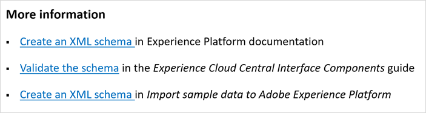

# Authoring-Stilrichtlinien für externe Mitwirkende {#guidelines}

Auf dieser Seite finden Sie redaktionelle Richtlinien für externe Autorinnen und Autoren, die Inhalte erstellen oder vorhandene Inhalte in Experience League aktualisieren. Achten Sie auf Folgendes, bevor Sie beginnen:

* Machen Sie sich mit [Markdown](markdown.md)-Authoring vertraut.
* Prüfen Sie die Rechtschreibung und Grammatik in Ihren Artikeln
* Verwenden Sie einen freundlichen Ton, eine konsistente Darstellung und einfache Sätze, um die maschinelle Übersetzung zu verbessern.
* Folgen Sie den [Best Practices](#writing-tips) und redaktionellen Standards auf dieser Seite.

## Stilrichtlinien {#style-guidelines}

Beachten Sie beim Schreiben der Dokumentation Folgendes.

* **Halten Sie sich kurz**: Verschwenden Sie keine Wörter. Halten Sie die Sätze kurz und knapp. Der Artikel soll fokussiert bleiben. Halten Sie die Anzahl der Hinweise gering.
* **Konzentrieren Sie sich auf die Zielgruppe und den Zweck**: Bevor Sie mit dem Schreiben beginnen, legen Sie eindeutig fest, wer der Kunde ist und welche Aufgabe er durchführen möchte. Schreiben Sie Ihren Artikel, um dem Kunden bei dieser Aufgabe zu helfen.
* **Verwenden Sie Beispiele**: Stellen Sie Beispiele zur Erläuterung von Konzepten bereit.
* **Organisieren Sie Ihren Inhalt**: Erstellen Sie Abschnitte, um die Anweisungen in besser verwaltbare Gruppen von Schritten zu unterteilen. Verwenden Sie einen Screenshot, wenn er der Klärung dient.

## Best Practices für das technische Schreiben {#writing-tips}

Technisches Schreiben, insbesondere für die Software-Dokumentation, ist ein spezielles Fachgebiet. Sogar der produktivste Romanautor wird beim Versuch des technischen Schreibens nervös – nicht weil die Materie komplex oder technisch ist, sondern weil es nicht leicht ist, komplexe, technische Informationen _einfach_ darzustellen. Um erfolgreich zu sein, muss der Inhalt strukturell konsistent, überschaubar und wiederverwendbar sein und ohne Struktur- und Syntaxfehler durch die Veröffentlichungs-Pipeline fließen.

In den folgenden Abschnitten werden häufig auftretende Probleme beschrieben, auf die neue Autoren achten müssen:

### Nicht durch Text getrennte Überschriften (doppelte Überschriften) {#double-headings}

Fügen Sie bei zwei Überschriften, die nicht durch Text voneinander getrennt sind, fehlenden Text hinzu (um die zweite Themenüberschrift einzuführen). Sie können auch eine der Überschriften entfernen. Die zweite ist wahrscheinlich unnötig.

Beispielweise erfült die Überschrift _Überblick_ hier keinen Zweck:

* Auch wenn Ihre zweite Überschrift zufällig _Überblick_ lautet, ist sie wahrscheinlich unnötig. Die H1-Überschrift und der erste Absatz dienen als konzeptioneller Überblick über das Artikelthema.

* Ähnlich gilt für SEO-Zwecke, dass eigenständige Überschriften wie _Überblick_ und _Einführung_ für sich selbst genommen nicht nützlich sind. Nennen Sie das Produkt oder die Funktion, die Sie vorstellen. (Beispiel: _Überblick über Fallout-Berichte_)

### Inkonsistente Überschriften in Querverweisen {#maps}

Verwenden Sie die Überschrift _Weitere Informationen_ für Querverweislisten (oder Karten). Beispiel:

**Leitlinien für Querverweislisten**

* Formatieren Sie Querverweise als Aufzählung.
* Formatieren Sie die formalen Namen von Handbüchern oder Seitennamen kursiv (wenn Sie keinen Link-Text verwenden).
* Setzen Sie keinen Punkt am Ende einer Überschrift.
* Vermeiden Sie Zahlen in Überschriften.

### Nicht übereinstimmender Inhaltsverzeichniseintrag, Breadcrumb und Seitenname {#toc}

Da wir die Datei mit dem Inhaltsverzeichnis manuell verwalten, passiert ein solcher Fehler sehr leicht. Stellen Sie sicher, dass der Inhaltsverzeichniseintrag mit dem Seitennamen (H1) übereinstimmt. Stellen Sie außerdem sicher, dass er mit dem Breadcrumb übereinstimmt.

**Anleitungen zu Inhaltsverzeichnissen und Listen**

* Möglicherweise müssen Sie den Eintrag im Inhaltsverzeichnis kürzen, er muss sich jedoch eindeutig auf den Seitennamen und den Breadcrumb beziehen.
* Breadcrumbs werden aus den Titel-Metadaten abgerufen, sodass sie (für SEO-Zwecke) unterschiedlich sein können.

### Anführungszeichen statt Kursivformatierung {#quotes}

Es ist schwer, dem Hinzufügen von Anführungszeichen um ein Wort oder eine Wortgruppe zu widerstehen. Anführungszeichen sind jedoch für Zitate vorgesehen und werden fast nie in der Produktdokumentation verwendet.

**Anleitungen zu Anführungszeichen**

* In der Regel funktionieren Kursivformatierungen (für Fehlermeldungen, eindeutige oder fremde Wörter usw.) besser als Anführungszeichen.
* Verwenden Sie für Elemente der Benutzeroberfläche Fettformatierung und UICONTROL.

### Vorgänge {#steps}

Das Schreiben eines Vorgangs (die _Aufgabe_ Content-Typ) ist kein Talent, das uns in die Wiege gelegt wurde. Die Erstellung eines lesbaren, verständlichen Vorgangs muss geübt werden.

**Anleitungen für Schritte**

* Ein Vorgang ist eine Reihe von Schritten. Ein Schritt ist ein kurzer, nummerierter, aus _einem Satz_ bestehender Befehl.
* Beginnen Sie jeden Schritt entweder mit einem Verb oder einem _erweiterten_ Infinitivsatz (zur Orientierung des Lesers in Richtung des Ziels, Beispiel: _Um angemeldet zu bleiben, aktivieren Sie **Angemeldet bleiben**_). Wenn ein Schritt innerhalb des gesamten Vorgangs ein bestimmtes Ziel hat, nennen Sie das Ziel vor der Aktion.
* Wenn Sie Informationen über den Schritt haben (einen Content-Typ namens _Schrittinfo_), fügen Sie sie nach dem Schritt (eingerückt mit dem Schritt) oder nach dem Asset (ein Screenshot, Video oder eine Liste mit Schnittstellenbeschreibungen) ein.
* Wenn Ihr Schritt zwei Aktionen hat (z. B. _Wählen Sie dies und dann das aus_), schreiben Sie dies in einem einzigen, kurzen Satz.
* Begrenzen Sie Ihre Aufgabe auf etwa sieben bis zehn Schritte. Wenn Sie mehr als zehn Schritte in einer Aufgabe erstellen, müssen Sie sie wahrscheinlich in zwei Aufgaben unterteilen. Entscheiden Sie hier nach eigenem Ermessen.
* Verwenden Sie in der Produktdokumentation keine Überschriften als Schritte. (Ausnahme unten für Tutorials.)
* Bei mehrseitigen Tutorials können Überschriften als Schritte zulässig sein. Nummerieren Sie sie jedoch nicht. Schreiben Sie stattdessen _Schritt 1:_, _Schritt 2:_ usw.

**Beispielvorgang**

Hier finden Sie ein gut strukturiertes Vorgehen für die Anmeldung bei Adobe:

So melden Sie sich bei Adobe an:

1. Wählen Sie auf `Adobe.com` die Option **Experience Cloud** aus.
1. Wählen Sie **Anmelden** aus.
1. Wählen Sie **Persönliches Konto** aus.
1. Um angemeldet zu bleiben, wählen Sie **Angemeldet bleiben** aus.
1. Geben Sie Ihren Namen und Ihr Kennwort ein.
1. Wählen Sie **Anmelden** aus.

### Parallele Listen {#lists}

Der parallele Aufbau von Listen erleichtert das Lesen und Nachschlagen. Listen umfassen ein Inhaltsverzeichnis (Table of Contents, TOC), (ungeordnete) Aufzählungslisten oder nummerierte Listen.

Beispiel-Inhaltsverzeichnis mit parallelen Einträgen:

Das vorherige Inhaltsverzeichnis ist aus folgenden Gründen ein gutes Beispiel:

* Konzeptuelle übergeordnete Einträge sind Substantive oder Substantivsätze
* Vorgänge (Aufgaben) sind aktive Verben (keine Gerundien)
* Bei allen Einträgen wird das erste Wort großgeschrieben

## Metadaten zu Titel und Beschreibung {#metadata}

Metadaten zu _Titel_ und _Beschreibung_ sind wichtig für SEO, das Auffinden von Inhalten und die Qualitätsbewertung von Inhalten bei Experience League.

Im Folgenden finden Sie Beispiele für Titel und Beschreibungen:

**Beschreibungen für Konzeptartikel**

* _Erfahren Sie mehr über Segmente in Adobe Analytics. Hier erhalten Sie Hilfe zum Konfigurieren des Bedienfelds „Segmentierung“ in einem Arbeitsbereich._
* _Hier erhalten Sie Hilfe zur Verwendung von Segmenten in einem Seitenansichtsbericht in Adobe Analytics._

**Beschreibungen für Artikel zu Vorgängen/Aufgaben**

* _Erfahren Sie, wie Sie ein Segment in Adobe Analytics erstellen._
* _Erstellen Sie ein Segment in Adobe Analytics. Erfahren Sie, wie Sie einen Bericht basierend auf dem erstellten Segment auswählen, konfigurieren und ausführen._

Welche Beschreibung Sie verwenden, hängt von der Größe und dem Umfang des Artikels ab.

**Titel für Konzeptartikel**

* _Segmente in Seitenansichtsberichten_

**Titel für Artikel zu Vorgängen/Aufgaben**

* _Erstellen eines Segments für Seitenansichtsberichte_

(Denken Sie daran, dass Pipe- und Produktname automatisch zu den Titeln hinzugefügt werden.)

## Möglichkeiten für eine klarere Darstellung (und bessere Acrolinx-Bewertungen) {#tips}

Im Folgenden finden Sie einfache Möglichkeiten für eine bessere inhaltliche Gestaltung, größere Klarheit und einfachere Lesbarkeit. Diese helfen auch zu besseren Acrolinx- und CQI-Bewertungen in ExL.

| Leitlinien | Informationen zu  |
|---|---|
| Aktiv-Formulierungen verwenden | Passiv-Formulierungen in Aktiv-Formulierungen ändern |
| Präsenz verwenden | **Schwach:** *Campaign v8 wird im Juni veröffentlicht werden.* 
**Stark:** *Campaign v8 wird im Juni veröffentlicht.*
Das Präsenz ist immer einfacher zu lesen. |
| Schwache, unnötige Adverbien vermeiden | *Sehr*, *extrem*, *unglaublich* … 
Adverben sind zusätzliche Wörter, die keine wichtige Bedeutung hinzufügen, wenn Sie aussagekräftige und genaue Verben, Sätze und Adjektive verwenden. |
| Aussagekräftige Verben für Titel und [Inhaltsverzeichniseinträge](#using-toc) verwenden | Beispiele:
**Schwach:** *Eigenschaftenerstellung und -verwaltung* 
**Stark:** *Erstellen und Verwalten von Eigenschaften* |
| Auf [Groß- und Kleinschreibung](https://docs.microsoft.com/de-de/style-guide/capitalization) achten | Achten Sie auf die Groß- und Kleinschreibung. Folgen Sie in Überschriften den deutschen Rechtschreibregeln. So werden Substantive und das erste Wort nach einem Punkt selbstverständlich großgeschrieben. Folgen Sie bei Vorgängen der in der Benutzeroberfläche verwendeten Schreibweise. |
| Befogen Sie diese kleinen Tipps für mehr Klarheit | <ul><li>Vermeiden Sie *unter Verwendung von* (umständlich mit keiner zusätzlichen Bedeutung). Meistens reicht ein einfaches *mit*.</li><li>Vermeiden Sie das Wort *benutzen.* Es ist zu umgangssprachlich. Verwenden Sie besser die Verben *verwenden* oder je nach Kontext *nutzen*.</li><li>Vermeiden Sie Semikolons. Setzen Sie stattdessen einen Punkt und beginnen Sie einen neuen Satz. Semikolons führen zu unnötiger Komplexität.</li><li>Doppelpunkt: Verwenden Sie Doppelpunkte, um eine Liste einzuleiten. Gehen Sie innerhalb von Sätzen sparsam mit Doppelpunkten um. Folgt nach dem Doppelpunkt ein ganzer Satz, muss das erste Wort großgeschrieben werden.</li><li>Verwenden Sie kein Komma vor „und“ oder „oder“ in Aufzählungen.</li><li>Achten Sie auf eine Satzlänge von weniger als 39 Wörtern.</li><li>Navigation: Verwenden Sie _Gehen Sie zu_ oder _Navigieren Sie zu_.</li><li>Vermeiden Sie Rohdaten-URL-Text (verwenden Sie stattdessen einen benutzerfreundlichen Link-Text), es sei denn, die Anzeige des Pfads ist mit wichtigen Informationen verbunden.</li></ul> |
| Rechtschreibprüfung in VSC verwenden | Installieren Sie die Code-Rechtschreibprüfung (Erweiterung) in Visual Studio Code. |
| Ändern Sie _Klicken_ in _Navigieren Sie zu_ oder _Wählen Sie ... aus_ | _Klicken_ ist ein gerätespezifisches Wort (mit Problemen in Bezug auf die Barrierefreiheit), und der Trend besteht darin, von diesem abzurücken. Im Folgenden finden Sie Vorschläge zur Änderung:<ul><li>Navigation: _Gehen Sie zu Datei > Drucken_.</li><li>Klicken: _Wählen Sie „Datei“ > „Drucken“_ oder _Wählen Sie „OK“_. </li></ul>Weitere Ideen für die beste Wortwahl in verschiedenen Situationen finden Sie unter [Beschreibung von Interaktionen mit der Benutzeroberfläche](https://docs.microsoft.com/de-de/style-guide/procedures-instructions/describing-interactions-with-ui). |
| Ausführen von Acrolinx in VSC | Acrolinx sucht nach Stil- und Grammatikproblemen. Er überprüft URLs, Terminologie, Rechtschreibung und mehr. Es hilft Ihnen, sich klarer auszudrücken und verbessert die Übersetzung von Experience League-Inhalten. |

{style="table-layout:auto"}

Ein paar weitere bewährte Verfahren und Ressourcen:

* [Überschaubare Inhalte](https://docs.microsoft.com/de-de/style-guide/scannable-content/): Helfen Sie den Lesern, schnell das zu finden, was sie brauchen, oder ggf. ebenso schnell zu erkennen, dass sie nicht da sind, wo sie sein sollten. Es kann hilfreich sein, so zu schreiben, dass ein Überfliegen leichter möglich ist.
* **Zahlen:** Schreiben Sie im Textkörper Zahlen von null bis neun aus und verwenden Sie Ziffern für 10 oder darüber. Siehe [Zahlen](https://docs.microsoft.com/de-de/style-guide/numbers).
* Schreiben Sie so, wie Sie sprechen, vermitteln Sie Freundlichkeit und kommen Sie schnell auf den Punkt.

Weitere Informationen finden Sie unter [Die 10 beliebtesten Tipps zum Schreiben](https://docs.microsoft.com/de-de/style-guide/top-10-tips-style-voice) im [Microsoft® Stilhandbuch](https://docs.microsoft.com/de-de/style-guide/welcome/).

## Alternativtext {#alt-text}

Fügen Sie Ihren Assets (Bildern) einen aussagekräftigen Alternativtext hinzu. Erwägen Sie einen Alternativtext, der Folgendes erfüllt:

* Das Ziel, das Kunden erreichen können (Aufgaben- oder Konzeptname)
* Die angezeigte Funktion oder Seite
* Der Name des angezeigten Symbols

Google berücksichtigt den Alternativtext in SEO-Ergebnissen.

## Lokalisierung – DNL und UICONTROL {#localization}

Sie müssen sich keine Gedanken darüber machen, ob Ihr Produkt lokalisiert ist oder welche Sprachen ExL verwendet. Sie können jedoch zur Verbesserung der Lokalisierungsqualität beitragen, indem Sie gegebenenfalls die beiden folgenden (erforderlichen) Markdown-Tags anwenden:

* `DNL`

  DNL bedeutet _nicht lokalisieren_. Sie verwenden es nur für markenrechtlich geschützte Adobe-Produktnamen, die alle in englischer Sprache bleiben müssen.

  Syntaxbeispiele: `[!DNL Adobe Campaign]` oder `[!DNL Workfront]`

  DNL ist nicht für Dateinamen oder URLs vorgesehen.

* `UICONTROL`

  UICONTROL bezeichnet eine Schnittstellensteuerung (z. B. eine Option, ein Feld, eine Registerkarte, eine Seite, eine Gruppe von Optionen oder einen Funktionsnamen in der Benutzeroberfläche).

  Syntaxbeispiel: `Select **[!UICONTROL Project]**, then select **[!UICONTROL Save]**.`

>[!IMPORTANT]
>
>Sie müssen diese Tags vor der Lokalisierung Ihres Inhalts anwenden.

### Verwenden von Adobe in Produktnamen {#product-names}

Für die Unternehmensidentität fügen wir in der Regel _Adobe_ bei der ersten Erwähnung eines Produkts auf der Ebene des Handbuchs ein. Aus Platzgründen können Sie „Adobe“ in der Überschrift weglassen, aber dann sollte die erste Erwähnung im Text den vollständigen Namen enthalten. Bestimmte Produkte, wie _Adobe Audition_ und _Adobe Premiere Pro_, erfordern die Verwendung von „Adobe“ bei der ersten oder markantesten Erwähnung in jedem Begleitmaterial, da es Teil des legalen, markengeschützten Namens ist.

## Erste Absätze {#firstparas}

Ihr erster Absatz sollte das Thema definieren und beschreiben, was der Leser durch das Lesen des Artikels erfährt.

Beispiel für ersten Absatz (Konzept):

_Zielgruppen sind Sammlungen von Besuchern (eine Liste von Besucher-IDs). Der Zielgruppen-Service von Adobe verwaltet die Übersetzung von Besucherdaten in Zielgruppensegmentierung. Auf diese Weise erfolgt das Erstellen und Verwalten von Zielgruppen so ähnlich wie das Erstellen und Verwalten von Segmenten, mit dem zusätzlichen Vorteil, dass die Zielgruppensegmente für Experience Cloud freigegeben werden können._

Beispiel für ersten Absatz (Aufgabe):

_Erstellen Sie die Kundenattributquelle (CSV- und FIN-Dateien) und laden Sie die Daten hoch. Sobald Sie dazu bereit sind, aktivieren Sie die Datenquelle. Nachdem die Datenquelle aktiv ist, geben Sie die Attributdaten für Analytics und Target frei._

### SEO-Tipps für erste Absätze {#seo}

* Nehmen Sie Suchbegriffe in erste Absätze auf.
* Verwenden Sie Begriffe, die Leser verwenden.
* Geben Sie Synonyme und, falls erforderlich, die frühere Verwendung von Begriffen an. Zum Beispiel: „Der Experience Cloud ID Service (ECID), früher bekannt als _Besucher-ID_ oder als Akronyme wie MID, MCVID, bietet eine universelle, dauerhafte ID, die Besucher identifiziert.“
* Schließen Sie SEO-Begriffe in Links ein.
* Vermeiden Sie es, wichtige Begriffe in komplexen Tabellen zu platzieren. Komplexe Tabellen liefern keine zuverlässigen Suchergebnisse. Text in Bildern wird nicht durchsucht, aber Untertitel.

## Großschreibung {#capitalization}

* Im Adobe-Stil werden alle Titel, Überschriften, Zwischenüberschriften und Seitennavigationselemente groß geschrieben.
* Alle Wörter werden klein geschrieben, mit Ausnahme des ersten Wortes und der Eigennamen, wie z.B. die Namen von Marken, Lösungen und Services.
* Halten Sie sich an die Groß-/Kleinschreibung in den Produktnamen von Tools, Optionen, Menüelementen, Dialogfeldern und Feldern.

## Inhaltsverzeichnis {#using-toc}

`TOC.md` ist das Inhaltsverzeichnis. Jedes Handbuch sollte über eines verfügen.

**Redaktionelle Leitlinien für Inhaltsverzeichnisse**

* Großschreibung: Schreiben Sie den ersten Buchstaben eines Eintrags immer groß (ausgenommen ggf. bei Akronymen). Halten Sie sich an die offizielle Schreibweise von Produktnamen oder Elemente in der Benutzeroberfläche (Seiten, Registerkarten, Felder, Optionen usw.). Halten Sie sich an die Begriffe in der Benutzeroberfläche, wenn Sie darauf verweisen.
* Verbformen und Parallelismus: Verwenden Sie Verben im Infinitiv und vermeiden Sie deren Substantivierung. Inhaltsverzeichnisse sind Listen. Versuchen Sie daher nach Möglichkeit, Listen konsistent zu halten. Es gibt Ausnahmen, die manchmal nicht zu vermeiden sind. Verwenden Sie für konzeptionelle Seiten Substantive und Substantivgruppen. Verwenden Sie für Aufgaben Verben.

**Leitlinien zur Syntax**

* Eine Abschnittsüberschrift (übergeordnetes Element) im Inhaltsverzeichnis kann kein Link sein, denn sie weist keine Seite mit Inhalt auf. Sie sollte einen Anker enthalten, z. B. `{#processing-rules}`.
* Sie müssen die richtige Syntax für Inhaltsverzeichnisüberschriften (z. B. `+ Processing rules {#processing-rules}`) und Links zu Inhaltsartikeln (z. B. `+ [Article name](article.md)`) verwenden.
* Inhaltsverzeichnis-Artikeleinträge können eine kürzere Version des Artikeltitels sein. Folgen Sie den Standards in diesem Dokument zum Verfassen von Überblicken, Konzepten und Aufgaben.
* Vermeiden Sie es, dieselbe Datei mehrfach einem Inhaltsverzeichnis (oder mehreren Inhaltsverzeichnissen) hinzuzufügen. Dies führt zu seltsamem Verhalten.
* Wenn Ihr Repository mehrere Benutzerhandbücher enthält, müssen sich Ihre Benutzerhandbuch-Verzeichnisse auf derselben Ebene befinden, z. B. die Unterverzeichnisse innerhalb des `help`-Verzeichnisses. Jedes Benutzerhandbuch-Verzeichnis muss über eine Inhaltsverzeichnisdatei verfügen. Kein Verschachteln von Benutzerhandbüchern.

## Fett- und Kursiv-Formatierung {#bold}

* Verwenden Sie fett gedruckten Text nur für Elemente der Benutzeroberfläche, auf die in einem Vorgang geklickt wird (und mit UICONTROL).
* Verwenden Sie eine Kursiv-Formatierung zur Hervorhebung oder für Wörter, wo es ansonsten verwirrend ist. Zum Beispiel für ein Fremdwort oder bei der Beschreibung eines Worts oder der Definition eines Begriffs.
